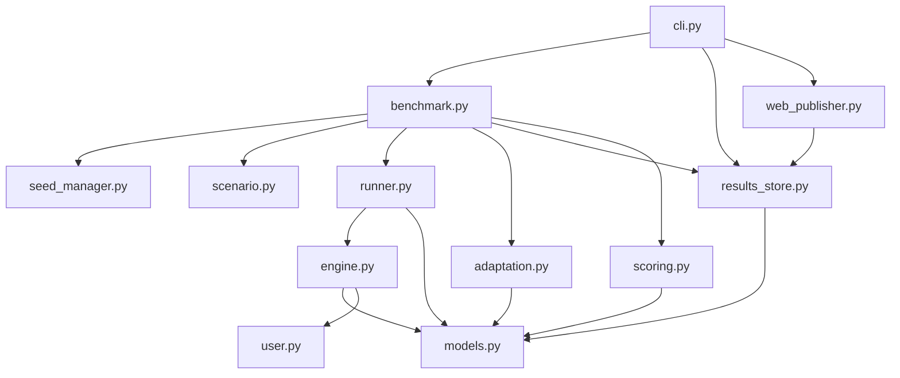

# Design Document: LLM Leaderboard Benchmark

## Overview

This design extends the existing Ad Auction Gym into a public LLM benchmark with a web leaderboard. The core simulation engine (auction pipeline, user model, competitor bots) remains unchanged. We add:

1. **Multi-scenario support** — YAML-defined scenarios loaded from a `scenarios/` directory
2. **Benchmark harness** — orchestrates LLM × scenario matrix runs with deterministic seeding
3. **Adaptation measurement** — computes learning metrics from daily logs (no LLM interface changes)
4. **Expanded bidder control surface** — audience modifiers, daypart modifiers, ad variants
5. **Dual evaluation suites** — each run produces two scores: Campaign_Efficiency (all 30 days) and Strategy_Optimization (final 7 days, days 24–30)
6. **Results persistence** — structured JSON storage with config hashing, both scores per result
7. **Web leaderboard** — static HTML publisher with two tabs (one per evaluation suite) for GitHub Pages
8. **CLI commands** — `aag-benchmark`, `aag-leaderboard`, `aag-results`

The design philosophy is **extend, don't rewrite**. New modules integrate with existing ones through well-defined interfaces. The existing `Bidder` ABC, `AuctionEngine`, `run_episode()`, and `DailyStrategy`/`DailyFeedback` models are extended in-place where needed and wrapped by new orchestration layers.

### v2 Expansions (Out of Scope for v1)

The following are documented for future reference but explicitly excluded from v1:

- **Richer headline relevance model**: Replace word-overlap in `UserSimulator._keyword_relevance()` with semantic similarity or LLM-based scoring. The current model rewards keyword stuffing; a semantic model would reward meaning-preserving paraphrases.
- **pCTR feedback loop improvements**: The platform's `PredictedCTRModel` currently uses a global prior + per-bidder historical CTR. v2 could incorporate bidder-specific historical CTR more aggressively, creating a stronger quality-score flywheel.
- **Adaptive/stateful competitor bots**: Current bots (`AggressiveBot`, `ConservativeBot`, `SmartBot`) use fixed strategies. v2 bots would observe market conditions and adapt, creating a more dynamic competitive landscape.

## Architecture

### New Modules and Integration

```
ad_auction_gym/
├── models.py              # MODIFIED: add audience_modifiers, daypart_modifiers, keyword_variants to DailyStrategy
│                          #           add variant_stats to DailyFeedback
├── engine.py              # MODIFIED: apply audience/daypart modifiers in Retriever, select ad variants
├── runner.py              # MODIFIED: aggregate per-variant stats, pass to DailyFeedback
├── rendering.py           # MODIFIED: render new fields (modifiers, variants) in LLM prompts
├── llm_bidder.py          # MODIFIED: parse new fields from LLM JSON response
├── scenario.py            # MODIFIED: add from_yaml() classmethod, config_hash() method
├── cli.py                 # MODIFIED: add aag-benchmark, aag-leaderboard, aag-results commands
│
├── benchmark.py           # NEW: BenchmarkHarness — orchestrates LLM × scenario matrix
├── adaptation.py          # NEW: AdaptationMetrics — computes learning metrics from daily logs
├── seed_manager.py        # NEW: SeedManager — deterministic seed derivation
├── results_store.py       # NEW: ResultsStore — JSON persistence + leaderboard.json
├── web_publisher.py       # NEW: WebPublisher — static HTML leaderboard generator
└── scoring.py             # NEW: Scoring — aggregate scores, ranking logic

scenarios/                 # NEW: YAML scenario definitions
├── searchads_v1.yaml      # Baseline "running shoes" scenario
├── high_competition.yaml  # Aggressive competitors, tight budget
└── diverse_vertical.yaml  # Mixed keyword economics

results/                   # NEW: benchmark output (gitignored except leaderboard.json)
├── leaderboard.json
├── searchads_v1/
│   ├── gpt-4o/
│   │   └── 2025-01-15T10:30:00.json
│   └── claude-sonnet/
│       └── 2025-01-15T10:45:00.json
└── ...

docs/
├── design.md              # MODIFIED: updated with benchmark architecture
└── leaderboard/           # NEW: static HTML output for GitHub Pages
    └── index.html
```

### Module Dependency Diagram



### Integration Points

1. **`scenario.py` extension**: Add `Scenario.from_yaml(path)` classmethod and `Scenario.config_hash()` for reproducibility. The existing `default_scenario()` remains as a fallback.

2. **`models.py` extension**: Add optional fields to `DailyStrategy` (audience_modifiers, daypart_modifiers, keyword_variants) and `DailyFeedback` (variant_stats). Existing code that doesn't use these fields is unaffected due to default values.

3. **`engine.py` modification**: The `Retriever.retrieve()` method applies audience and daypart modifiers to the base bid. The engine selects a random ad variant when `keyword_variants` is present.

4. **`runner.py` modification**: Aggregate per-variant stats alongside per-keyword stats. Pass variant stats in `DailyFeedback`.

5. **`benchmark.py` wraps `runner.py`**: The harness calls `run_episode()` for each (LLM, scenario) pair, then computes adaptation metrics and persists results.


## Components and Interfaces

### 1. Scenario Loading (`scenario.py` extension)

```python
@dataclass
class Scenario:
    # ... existing fields ...
    competitor_config: list[dict] = field(default_factory=list)  # NEW: competitor definitions from YAML

    @classmethod
    def from_yaml(cls, path: Path) -> "Scenario":
        """Load a scenario from a YAML file."""
        ...

    def config_hash(self) -> str:
        """SHA-256 hash of the scenario configuration for reproducibility checks."""
        ...
```

YAML format:

```yaml
name: SearchAds-v1
duration_days: 30
agent_budget: 10000.0
reserve_price: 0.10
seed: 42
keywords:
  - text: "buy running shoes online"
    daily_volume: 120
    base_cpc: 3.50
    base_cvr: 0.10
    avg_order_value: 130.0
    intent: transactional
  # ...
competitors:
  - type: aggressive
    daily_budget: 500.0
  - type: conservative
    daily_budget: 200.0
  - type: smart
    daily_budget: 350.0
```

Scenario discovery: `benchmark.py` globs `scenarios/*.yaml` and loads all found files. New scenarios are picked up automatically without code changes.

### 2. Seed Manager (`seed_manager.py`)

```python
class SeedManager:
    """Derives deterministic sub-seeds from a single root seed."""

    def __init__(self, root_seed: int):
        self.root_seed = root_seed

    def engine_seed(self, scenario_name: str, model_name: str) -> int:
        """Deterministic seed for the auction engine."""
        ...

    def user_seed(self, scenario_name: str, model_name: str) -> int:
        """Deterministic seed for the user simulator."""
        ...

    def competitor_seed(self, scenario_name: str, model_name: str, competitor_idx: int) -> int:
        """Deterministic seed for a specific competitor bot."""
        ...
```

Seed derivation uses `hashlib.sha256(f"{root_seed}:{scenario_name}:{model_name}:{component}".encode())` truncated to a 32-bit integer. This ensures:
- Same root seed + same scenario + same model → identical simulation
- Different models get different seeds (so they don't see identical auction sequences)
- Adding a new model doesn't change seeds for existing models

### 3. Benchmark Harness (`benchmark.py`)

```python
@dataclass
class RunConfig:
    """Configuration for a single benchmark run."""
    model_name: str
    model_type: str  # "llm" or "baseline"
    bidder_factory: Callable[[], Bidder]
    scenario: Scenario

@dataclass
class RunResult:
    """Extended episode result with benchmark metadata."""
    episode_result: EpisodeResult
    adaptation_metrics: AdaptationMetrics
    model_name: str
    model_type: str
    scenario_name: str
    scenario_hash: str
    root_seed: int
    wall_clock_seconds: float
    llm_api_calls: int
    software_version: str
    strategy_optimization_score: float  # profit from final 7 days (days 24–30)

class BenchmarkHarness:
    """Orchestrates benchmark runs across LLMs × scenarios."""

    def __init__(
        self,
        llm_configs: list[dict],       # [{name, llm_fn}]
        scenario_names: list[str] | None,  # None = all discovered scenarios
        root_seed: int = 42,
    ):
        ...

    def run_all(self) -> list[RunResult]:
        """Execute all (model, scenario) pairs and return results."""
        ...

    def _run_single(self, config: RunConfig) -> RunResult:
        """Execute a single run with timing and error handling."""
        ...
```

The harness:
1. Discovers scenarios from `scenarios/` directory
2. Creates `RunConfig` for each (model, scenario) pair, including all baselines
3. Executes each run via `run_episode()` with seeds from `SeedManager`
4. Wraps `LLMBidder` to count API calls and measure wall-clock time
5. Computes `AdaptationMetrics` from the `EpisodeResult.daily_log`
6. Computes `strategy_optimization_score` by summing daily profit from the daily_log for days 24–30 (the final 7 days)
7. Persists each `RunResult` via `ResultsStore`

### 4. Adaptation Metrics (`adaptation.py`)

```python
@dataclass
class AdaptationMetrics:
    """Metrics derived from daily logs measuring LLM learning behavior."""
    learning_rate: float                    # (late_profit - early_profit) / early_profit
    strategy_volatility: list[float]        # per-day volatility scores
    learning_days: int                      # days with volatility > threshold
    optimizing_days: int                    # days with volatility <= threshold
    profit_trajectory: list[float]          # daily profit time series
    convergence_day: int | None             # day when profit stabilized within 10% of mean
    keyword_convergence_day: int | None     # day when keyword selection stabilized

def compute_adaptation_metrics(
    daily_log: list[DailyFeedback],
    daily_strategies: list[DailyStrategy],
    volatility_threshold: float = 0.3,
) -> AdaptationMetrics:
    """Compute adaptation metrics from an episode's daily logs and strategies."""
    ...
```

**Strategy Volatility** for day `d` is computed as:

```
volatility(d) = jaccard_distance(keywords_d, keywords_{d-1})
              + normalized_bid_change(bids_d, bids_{d-1})
```

Where:
- `jaccard_distance` = 1 - |A ∩ B| / |A ∪ B| for keyword sets
- `normalized_bid_change` = mean(|bid_d[k] - bid_{d-1}[k]| / max(bid_{d-1}[k], 0.01)) for shared keywords

**Learning Rate**:
```
early_mean = mean(profit[0:10])
late_mean = mean(profit[20:30])
learning_rate = (late_mean - early_mean) / abs(early_mean) if early_mean != 0 else 0
```

**Convergence Day**: First day `d` where all subsequent days have profit within 10% of the episode mean profit.

**Keyword Convergence Day**: First day `d` where the set of bid-on keywords doesn't change for the rest of the episode.

Note: `compute_adaptation_metrics` requires both `daily_log` (from `EpisodeResult`) and `daily_strategies` (captured by the harness during the run). The runner is modified to also collect the list of `DailyStrategy` objects returned by the bidder each day.

### 5. Results Store (`results_store.py`)

```python
class ResultsStore:
    """Persists and loads benchmark results as JSON files."""

    def __init__(self, base_dir: Path = Path("results")):
        self.base_dir = base_dir

    def save(self, result: RunResult) -> Path:
        """Save a RunResult to results/{scenario}/{model}/{timestamp}.json."""
        ...

    def load_all(self) -> list[RunResult]:
        """Load all stored results."""
        ...

    def update_leaderboard(self, results: list[RunResult]) -> None:
        """Write results/leaderboard.json with top result per (model, scenario) pair.

        Each entry includes both campaign_efficiency_score (total_profit) and
        strategy_optimization_score for dual-suite leaderboard generation.
        """
        ...

    def validate_hash(self, result_path: Path, current_scenarios: dict[str, Scenario]) -> bool:
        """Check if a result's scenario hash matches the current scenario definition."""
        ...
```

JSON file structure:

```json
{
  "model_name": "gpt-4o",
  "model_type": "llm",
  "scenario_name": "SearchAds-v1",
  "scenario_hash": "a1b2c3...",
  "root_seed": 42,
  "software_version": "1.0.0",
  "wall_clock_seconds": 145.2,
  "llm_api_calls": 30,
  "campaign_efficiency_score": 4215.50,
  "strategy_optimization_score": 1823.40,
  "episode_result": {
    "bidder_name": "gpt-4o",
    "total_spend": 8234.50,
    "total_revenue": 12450.00,
    "total_profit": 4215.50,
    "total_impressions": 15234,
    "total_clicks": 2341,
    "total_conversions": 98,
    "days": 30,
    "budget": 10000.0,
    "daily_log": [...]
  },
  "adaptation_metrics": {
    "learning_rate": 0.45,
    "strategy_volatility": [0.8, 0.6, ...],
    "learning_days": 12,
    "optimizing_days": 18,
    "profit_trajectory": [120.5, 135.2, ...],
    "convergence_day": 15,
    "keyword_convergence_day": 10
  }
}
```

### 6. Scoring and Ranking (`scoring.py`)

```python
@dataclass
class LeaderboardEntry:
    """One row in the leaderboard."""
    rank: int
    model_name: str
    model_type: str  # "llm" or "baseline"
    aggregate_score: float  # mean of per-scenario scores for the selected suite
    per_scenario_scores: dict[str, float]
    campaign_efficiency_score: float  # aggregate across scenarios for Campaign_Efficiency
    strategy_optimization_score: float  # aggregate across scenarios for Strategy_Optimization
    roas: float
    cpa: float
    ctr: float
    cvr: float
    total_conversions: int
    learning_rate: float
    learning_days_ratio: float
    llm_api_calls: int


def compute_strategy_optimization_score(daily_log: list) -> float:
    """Sum daily profit for days 24–30 (the final 7 days).

    Days are 1-indexed in the daily_log (day field). If the episode has
    fewer than 24 days, returns 0.0.
    """
    return sum(fb.profit for fb in daily_log if 24 <= fb.day <= 30)


def compute_leaderboard(
    results: list[RunResult],
    suite: str = "campaign_efficiency",
) -> list[LeaderboardEntry]:
    """Compute a ranked leaderboard from run results for a given evaluation suite.

    ``suite`` is one of ``"campaign_efficiency"`` or ``"strategy_optimization"``.
    Entries are ranked by the selected suite's aggregate score.
    """
    ...
```

Ranking logic:
1. Group results by model name
2. For each model, take the best result per scenario (by the selected suite's score)
3. Compute aggregate score = mean of per-scenario scores for the selected suite
4. Rank by aggregate score descending
5. Average secondary metrics (ROAS, CPA, etc.) across scenarios
6. Each entry carries both `campaign_efficiency_score` and `strategy_optimization_score` aggregates

The Campaign_Efficiency score for a run is `episode_result.total_profit` (all 30 days). The Strategy_Optimization score is `strategy_optimization_score` (final 7 days, days 24–30), computed by `compute_strategy_optimization_score()` from the daily_log.

### 7. Web Publisher (`web_publisher.py`)

```python
class WebPublisher:
    """Generates static HTML leaderboard for GitHub Pages."""

    def __init__(self, results_dir: Path = Path("results"), output_dir: Path = Path("docs/leaderboard")):
        ...

    def generate(self) -> None:
        """Read leaderboard.json and produce index.html with dual suite tabs."""
        ...
```

The publisher generates a single `index.html` with:
- Two tabs: "Campaign Efficiency" and "Strategy Optimization"
- Each tab contains a ranked table sorted by that suite's aggregate score
- Scenario filter dropdown (client-side filtering) works within each tab
- Client-side JavaScript for tab switching (shows/hides the corresponding table)
- "How It Works" section explaining the benchmark methodology and the two evaluation suites
- Model type labels ("LLM" / "Baseline") for each entry
- Embedded CSS for a clean, readable layout

No external dependencies — pure HTML/CSS/JS for GitHub Pages compatibility.

Tab switching implementation: two `<div>` containers (one per suite), each with its own `<table>`. Only the active tab's container is visible (`display: block` vs `display: none`). Tab buttons toggle the active class and container visibility. The scenario filter applies to whichever tab is currently active.

### 8. CLI Commands (`cli.py` extension)

```python
# New entry points in pyproject.toml:
# aag-benchmark = "ad_auction_gym.cli:benchmark_main"
# aag-leaderboard = "ad_auction_gym.cli:leaderboard_main"
# aag-results = "ad_auction_gym.cli:results_main"

def benchmark_main():
    """aag-benchmark [--models m1,m2] [--scenarios s1,s2] [--seed 42]"""
    ...

def leaderboard_main():
    """aag-leaderboard — generate static HTML from results."""
    ...

def results_main():
    """aag-results — print summary table to terminal."""
    ...
```

### 9. Expanded Bidder Control Surface (models.py + engine.py modifications)

#### DailyStrategy Extensions

```python
@dataclass
class DailyStrategy:
    keyword_bids: dict[str, float] = field(default_factory=dict)
    keyword_headlines: dict[str, str] = field(default_factory=dict)
    daily_budget: float = float("inf")
    reasoning: str = ""
    # NEW fields:
    audience_modifiers: dict[str, float] = field(default_factory=dict)    # segment → multiplier
    daypart_modifiers: dict[str, float] = field(default_factory=dict)     # "HH-HH" → multiplier
    keyword_variants: dict[str, list[str]] = field(default_factory=dict)  # keyword → [headline1, headline2, ...]
```

#### Engine Modifier Application

In `Retriever.retrieve()`, after looking up the base bid:

```python
# Apply audience modifier
aud_mod = strategy.audience_modifiers.get(user.segment, 1.0)
aud_mod = max(aud_mod, 0.0)  # clamp negative to 0

# Apply daypart modifier
day_mod = _get_daypart_modifier(strategy.daypart_modifiers, hour)
day_mod = max(day_mod, 0.0)  # clamp negative to 0

effective_bid = bid * aud_mod * day_mod
```

The `Retriever.retrieve()` signature changes to accept `user: UserProfile` and `hour: int` parameters so it can apply modifiers. This is the minimal change needed.

#### Ad Variant Selection

In `engine._run_query()`, after selecting the winner:

```python
variants = winner_strategy.keyword_variants.get(kw.text, [])
if variants:
    headline = rng.choice(variants)
    variant_index = variants.index(headline)
else:
    headline = winner_strategy.keyword_headlines.get(kw.text, "")
    variant_index = None
```

The `AuctionOutcome` is extended with an optional `variant_index` field to enable per-variant stat aggregation.

#### DailyFeedback Variant Stats

```python
@dataclass(frozen=True)
class VariantDayStats:
    """Per-variant performance for a keyword on a single day."""
    variant_index: int
    headline: str
    impressions: int = 0
    clicks: int = 0
    conversions: int = 0
    spend: float = 0.0
    revenue: float = 0.0

@dataclass(frozen=True)
class DailyFeedback:
    # ... existing fields ...
    variant_stats: dict[str, list[VariantDayStats]] = field(default_factory=dict)  # keyword → [variant stats]
```

#### Daypart Modifier Parsing

Hour-range strings like `"10-12"` are parsed as: the modifier applies when `start <= hour < end`. A helper function handles this:

```python
def _get_daypart_modifier(daypart_modifiers: dict[str, float], hour: int) -> float:
    for range_str, modifier in daypart_modifiers.items():
        start, end = map(int, range_str.split("-"))
        if start <= hour < end:
            return modifier
    return 1.0
```

#### Audience Modifier Validation

Only the four defined segments are accepted: `young_professional`, `budget_shopper`, `enthusiast`, `casual`. Unknown segment keys in `audience_modifiers` are silently ignored (the modifier defaults to 1.0 for unrecognized segments since the user profile segment won't match).


## Data Models

### Existing Models (Modified)

#### DailyStrategy (extended)

| Field | Type | Default | Description |
|-------|------|---------|-------------|
| keyword_bids | dict[str, float] | {} | keyword → CPC bid |
| keyword_headlines | dict[str, str] | {} | keyword → ad headline |
| daily_budget | float | inf | daily spend cap |
| reasoning | str | "" | optional reasoning |
| audience_modifiers | dict[str, float] | {} | segment → bid multiplier (NEW) |
| daypart_modifiers | dict[str, float] | {} | "HH-HH" → bid multiplier (NEW) |
| keyword_variants | dict[str, list[str]] | {} | keyword → [headline variants] (NEW) |

#### DailyFeedback (extended)

| Field | Type | Default | Description |
|-------|------|---------|-------------|
| day | int | — | day number |
| impressions | int | — | total impressions |
| clicks | int | — | total clicks |
| conversions | int | — | total conversions |
| spend | float | — | total spend |
| revenue | float | — | total revenue |
| profit | float | — | revenue - spend |
| budget_remaining | float | — | remaining budget |
| keyword_stats | dict[str, KeywordDayStats] | {} | per-keyword breakdown |
| variant_stats | dict[str, list[VariantDayStats]] | {} | per-keyword variant breakdown (NEW) |

#### EpisodeResult (extended)

| Field | Type | Default | Description |
|-------|------|---------|-------------|
| ... existing fields ... | | | |
| daily_strategies | list[DailyStrategy] | [] | strategies used each day (NEW, for adaptation metrics) |

#### AuctionOutcome (extended)

| Field | Type | Default | Description |
|-------|------|---------|-------------|
| ... existing fields ... | | | |
| variant_index | int \| None | None | index into keyword_variants list (NEW) |
| ad_headline | str | "" | the headline shown (NEW, for variant tracking) |

#### Scenario (extended)

| Field | Type | Default | Description |
|-------|------|---------|-------------|
| ... existing fields ... | | | |
| competitor_config | list[dict] | [] | competitor type + params from YAML (NEW) |

### New Models

#### VariantDayStats

| Field | Type | Default | Description |
|-------|------|---------|-------------|
| variant_index | int | — | index in the variants list |
| headline | str | — | the headline text |
| impressions | int | 0 | impressions for this variant |
| clicks | int | 0 | clicks for this variant |
| conversions | int | 0 | conversions for this variant |
| spend | float | 0.0 | spend for this variant |
| revenue | float | 0.0 | revenue for this variant |

#### AdaptationMetrics

| Field | Type | Default | Description |
|-------|------|---------|-------------|
| learning_rate | float | — | (late_profit - early_profit) / abs(early_profit) |
| strategy_volatility | list[float] | — | per-day volatility scores (day 1 onward) |
| learning_days | int | — | count of days with volatility > threshold |
| optimizing_days | int | — | count of days with volatility ≤ threshold |
| profit_trajectory | list[float] | — | daily profit time series |
| convergence_day | int \| None | — | first day where profit stabilized |
| keyword_convergence_day | int \| None | — | first day where keyword set stabilized |

#### RunResult

| Field | Type | Description |
|-------|------|-------------|
| episode_result | EpisodeResult | full episode scorecard |
| adaptation_metrics | AdaptationMetrics | learning behavior metrics |
| model_name | str | display name |
| model_type | str | "llm" or "baseline" |
| scenario_name | str | scenario identifier |
| scenario_hash | str | SHA-256 of scenario config |
| root_seed | int | root seed used |
| wall_clock_seconds | float | execution time |
| llm_api_calls | int | total LLM API calls |
| software_version | str | from pyproject.toml |
| strategy_optimization_score | float | profit from final 7 days (days 24–30) |

#### LeaderboardEntry

| Field | Type | Description |
|-------|------|-------------|
| rank | int | position in leaderboard (within a suite) |
| model_name | str | display name |
| model_type | str | "llm" or "baseline" |
| aggregate_score | float | mean of per-scenario scores for the selected suite |
| per_scenario_scores | dict[str, float] | scenario → score for the selected suite |
| campaign_efficiency_score | float | aggregate Campaign_Efficiency score |
| strategy_optimization_score | float | aggregate Strategy_Optimization score |
| roas | float | averaged ROAS |
| cpa | float | averaged CPA |
| ctr | float | averaged CTR |
| cvr | float | averaged CVR |
| total_conversions | int | summed conversions |
| learning_rate | float | averaged learning rate |
| learning_days_ratio | float | learning_days / total_days |
| llm_api_calls | int | total API calls |


## Correctness Properties

*A property is a characteristic or behavior that should hold true across all valid executions of a system — essentially, a formal statement about what the system should do. Properties serve as the bridge between human-readable specifications and machine-verifiable correctness guarantees.*

### Property 1: Scenario YAML Round Trip

*For any* valid Scenario object, writing it to YAML via the scenario serialization format and then loading it back via `Scenario.from_yaml()` should produce a Scenario with identical keywords, budget, duration, competitor configuration, and seed.

**Validates: Requirements 1.1, 1.2**

### Property 2: Scenario Discovery

*For any* set of valid YAML files placed in the `scenarios/` directory, the scenario discovery function should return a set of Scenario objects whose names match exactly the set of YAML file names (minus extension).

**Validates: Requirements 1.4**

### Property 3: Seed Derivation Determinism

*For any* root seed, scenario name, and model name, calling the SeedManager's seed derivation functions twice with the same inputs should produce identical seeds. Additionally, different (scenario, model) pairs should produce different seeds.

**Validates: Requirements 2.2, 5.1**

### Property 4: Harness Produces Complete Run Matrix

*For any* list of N model configurations and M scenarios, the benchmark harness should produce exactly N × M RunResults (plus baseline count × M for the auto-included baselines).

**Validates: Requirements 2.3, 8.1**

### Property 5: LLM Failure Resilience

*For any* LLM callable that raises an exception on every call, running a full episode through the harness should still produce a valid EpisodeResult with `days` equal to the scenario's `duration_days` (the fallback strategy is used for every day).

**Validates: Requirements 2.5**

### Property 6: Run Metadata Presence

*For any* completed RunResult, `wall_clock_seconds` should be > 0 and `llm_api_calls` should be >= 0 (and > 0 for LLM-type runs, == 0 for baseline-type runs).

**Validates: Requirements 2.6**

### Property 7: Strategy Volatility Identity

*For any* two identical DailyStrategy objects (same keyword_bids, same keyword_headlines), the computed strategy volatility between them should be 0.0. Conversely, for any two strategies with completely disjoint keyword sets, volatility should be > 0.

**Validates: Requirements 3.2**

### Property 8: Learning/Optimizing Day Partition

*For any* list of strategy volatility values and any threshold, the count of learning days plus the count of optimizing days should equal the total number of classifiable days (len(volatility) values). A day is a learning day if and only if its volatility exceeds the threshold.

**Validates: Requirements 3.3**

### Property 9: Learning Rate Formula

*For any* profit trajectory of length ≥ 30, the learning rate should equal `(mean(profit[20:30]) - mean(profit[0:10])) / abs(mean(profit[0:10]))` when the early mean is non-zero, and 0.0 when the early mean is zero.

**Validates: Requirements 3.4**

### Property 10: Convergence Day Correctness

*For any* profit trajectory and computed convergence day `d`, all daily profits from day `d` onward should be within 10% of the episode mean profit. If no such day exists, convergence_day should be None.

**Validates: Requirements 3.5**

### Property 11: Results Persistence Round Trip

*For any* valid RunResult, saving it via `ResultsStore.save()` and then loading it back via `ResultsStore.load_all()` should produce a RunResult with identical model_name, scenario_name, scenario_hash, root_seed, software_version, wall_clock_seconds, llm_api_calls, strategy_optimization_score, and episode_result fields (total_profit, total_spend, total_revenue, etc.).

**Validates: Requirements 4.1, 4.2, 5.3, 10.6**

### Property 12: Leaderboard Best-Per-Pair Selection

*For any* set of RunResults containing multiple runs for the same (model, scenario) pair, the leaderboard.json should contain exactly one entry per unique (model, scenario) pair, and that entry's profit should equal the maximum profit among all runs for that pair.

**Validates: Requirements 4.3**

### Property 13: Scenario Hash Mismatch Detection

*For any* stored result whose scenario_hash differs from the current scenario's `config_hash()`, the `ResultsStore.validate_hash()` function should return False (flagging a mismatch).

**Validates: Requirements 4.4, 5.4**

### Property 14: Simulation Reproducibility

*For any* deterministic bidder (one whose `strategy()` output depends only on the feedback input), running two episodes with the same root seed and scenario should produce identical EpisodeResults (same total_profit, total_spend, total_revenue, total_impressions, total_clicks, total_conversions).

**Validates: Requirements 5.2**

### Property 15: Leaderboard HTML Contains Both Tabs and All Required Fields

*For any* set of LeaderboardEntries, the generated HTML should contain two tab elements (one for "Campaign Efficiency" and one for "Strategy Optimization"), and within each tab, every entry should display the model name, that suite's profit score, ROAS, CPA, CTR, CVR, total conversions, learning rate, learning days ratio, and LLM API call count as text content.

**Validates: Requirements 6.2, 6.5**

### Property 16: CLI Filtering

*For any* subset of model names passed via `--models` and any subset of scenario names passed via `--scenarios`, the benchmark harness should produce results only for the specified models and scenarios (plus baselines, which are always included).

**Validates: Requirements 7.4, 7.5**

### Property 17: Model Type Labeling

*For any* LeaderboardEntry, if the underlying bidder is one of SimpleBidder, BudgetPacingBidder, or KeywordValueBidder, the model_type should be "baseline". For all LLMBidder entries, the model_type should be "llm".

**Validates: Requirements 8.2, 8.3**

### Property 18: Dual Score Computation

*For any* RunResult with a daily_log of 30 days, the Campaign_Efficiency score (i.e. `episode_result.total_profit`) should equal the sum of daily profit across all 30 days, and the `strategy_optimization_score` should equal the sum of daily profit for only days 24 through 30 (the final 7 days).

**Validates: Requirements 10.1, 10.2**

### Property 19: Per-Suite Leaderboard Ranking

*For any* set of RunResults across multiple scenarios and for each evaluation suite (Campaign_Efficiency and Strategy_Optimization), the leaderboard's aggregate_score for each model should equal the arithmetic mean of that model's per-scenario scores within that suite, and entries should be ranked in descending order of aggregate_score. The two suites may produce different rankings for the same set of models.

**Validates: Requirements 10.3, 10.4, 10.5**

### Property 20: Bid Modifier Application

*For any* base keyword bid, audience modifier (for a matching segment), and daypart modifier (for a matching hour range), the effective bid used in ranking should equal `base_bid × max(audience_modifier, 0.0) × max(daypart_modifier, 0.0)`. When either modifier is absent or the segment/hour doesn't match, the corresponding multiplier defaults to 1.0. Negative modifiers are clamped to 0.0.

**Validates: Requirements 11a.2, 11a.3, 11a.4, 11a.5, 11b.2, 11b.3, 11b.4, 11b.5**

### Property 21: Ad Variant Selection

*For any* keyword with N variants (1 ≤ N ≤ 3) in `keyword_variants`, each auction for that keyword should use exactly one of the N headlines. When `keyword_variants` is omitted for a keyword, the headline from `keyword_headlines` should be used instead.

**Validates: Requirements 11c.2, 11c.3**

### Property 22: Variant Stats Consistency

*For any* day where a keyword used multiple ad variants, the sum of per-variant impressions, clicks, conversions, spend, and revenue in `variant_stats` should equal the corresponding totals in `keyword_stats` for that keyword.

**Validates: Requirements 11c.4**

### Property 23: Strategy Optimization Score for Short Episodes

*For any* episode with fewer than 24 days (budget exhausted early), the `strategy_optimization_score` should be 0.0 since there are no days in the 24–30 range.

**Validates: Requirements 10.2**


## Error Handling

### LLM API Failures

- **During a run**: If `llm_fn()` raises any exception, the `LLMBidder` catches it and returns `_default_strategy()` (fixed $2.00 bids on all keywords, evenly paced budget). The harness logs the failure with day number and exception message. The episode continues.
- **All calls fail**: The episode completes using fallback strategies for every day. The RunResult is still valid and persisted. The `llm_api_calls` count reflects attempted calls (not successful ones).
- **Timeout**: LLM callables should implement their own timeout logic. The harness does not impose a timeout — this is the caller's responsibility when constructing the `llm_fn`.

### Scenario Loading Errors

- **Invalid YAML**: `Scenario.from_yaml()` raises `ValueError` with a descriptive message. The harness skips the scenario and logs a warning.
- **Missing required fields**: YAML files missing `name`, `keywords`, or `duration_days` raise `ValueError`.
- **Empty scenarios directory**: The harness raises `FileNotFoundError` if no valid scenarios are found.

### Results Persistence Errors

- **Disk write failure**: `ResultsStore.save()` raises `IOError`. The harness catches this, logs the error, and continues with remaining runs. Results that failed to persist are not included in leaderboard generation.
- **Corrupt JSON on load**: `ResultsStore.load_all()` skips files that fail JSON parsing and logs a warning per file.
- **Hash mismatch**: Not an error — the result loads successfully but `validate_hash()` returns False and a warning is emitted. The result is still included in the leaderboard but flagged.

### Modifier Edge Cases

- **Negative modifiers**: Clamped to 0.0 (effective bid becomes 0, bidder is excluded from that auction).
- **Overlapping daypart ranges**: First matching range wins (iteration order of the dict). This is documented behavior, not an error.
- **Unknown segment in audience_modifiers**: Silently ignored — the modifier is never applied because no user profile will match an undefined segment.
- **More than 3 variants**: Only the first 3 are used. Additional variants are silently dropped.
- **Empty variants list**: Falls back to `keyword_headlines`.

### Adaptation Metrics Edge Cases

- **Episode shorter than 30 days** (budget exhausted early): Learning rate uses available days. If fewer than 10 early days or 10 late days exist, learning_rate is 0.0. Strategy_optimization_score is 0.0 if the episode has fewer than 24 days.
- **Zero early-episode profit**: Learning rate is 0.0 (division by zero avoided).
- **Single-day episode**: All volatility metrics are empty/zero. No learning or optimizing days. Strategy_optimization_score is 0.0.

## Testing Strategy

### Testing Framework

- **Unit tests**: `pytest` (already in dev dependencies)
- **Property-based tests**: `hypothesis` (to be added to dev dependencies)
- Minimum 100 iterations per property test (Hypothesis default is 100, which satisfies this)

### Property-Based Tests

Each correctness property from the design document is implemented as a single Hypothesis property test. Tests are tagged with comments referencing the design property:

```python
# Feature: llm-leaderboard-benchmark, Property 1: Scenario YAML Round Trip
@given(scenario=scenario_strategy())
def test_scenario_yaml_round_trip(scenario, tmp_path):
    ...
```

Property tests require custom Hypothesis strategies (generators) for:
- `Scenario` objects with random keywords, budgets, durations
- `DailyStrategy` objects with random bids, modifiers, variants
- `DailyFeedback` objects with random stats
- `RunResult` objects with random metadata
- `EpisodeResult` objects with random daily logs
- Profit trajectories (lists of floats)

### Unit Tests

Unit tests cover specific examples, edge cases, and integration points:

- **Scenario loading**: Load each of the 3 built-in YAML scenarios and verify fields (Req 1.3)
- **CLI entry points**: Verify `aag-benchmark`, `aag-leaderboard`, `aag-results` are callable (Req 7.1-7.3)
- **Web publisher output**: Generate HTML from sample data, verify file exists at `docs/leaderboard/index.html` (Req 6.1, 6.8)
- **Leaderboard "How It Works" section**: Verify the generated HTML contains the methodology section and mentions both evaluation suites (Req 6.7)
- **Scenario filter in HTML**: Verify the generated HTML contains scenario filter UI elements within each tab (Req 6.6)
- **Dual tabs in HTML**: Verify the generated HTML contains tab elements for Campaign Efficiency and Strategy Optimization (Req 6.2)
- **Edge cases**: Empty variants list fallback, negative modifier clamping, zero-profit learning rate, short episodes, strategy_optimization_score for episodes shorter than 24 days

### Test Organization

```
tests/
├── test_scenario.py          # Property 1, 2 + scenario loading unit tests
├── test_seed_manager.py      # Property 3
├── test_benchmark.py         # Property 4, 5, 6, 16
├── test_adaptation.py        # Property 7, 8, 9, 10
├── test_results_store.py     # Property 11, 12, 13
├── test_reproducibility.py   # Property 14
├── test_web_publisher.py     # Property 15 + HTML unit tests
├── test_scoring.py           # Property 17, 18, 19, 23
├── test_modifiers.py         # Property 20
├── test_variants.py          # Property 21, 22
└── conftest.py               # Shared Hypothesis strategies and fixtures
```

### Dependencies Addition

```toml
[project.optional-dependencies]
dev = ["pytest>=7.0", "pytest-cov", "hypothesis>=6.0", "pyyaml>=6.0"]

[project.dependencies]
# pyyaml also needed at runtime for scenario loading
dependencies = ["numpy>=1.24", "pyyaml>=6.0"]
```

